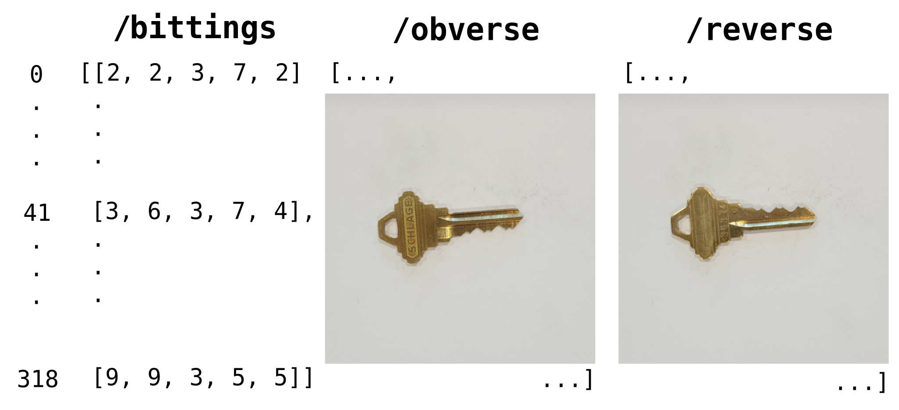

# KeyDB: An Open Source Dataset of Key Bittings

This repository introduces a dataset of obverse and reverse images of 319 unique Schlage SC1 keys, labeled with each key's bitting code.




## Usage

1. Download the dataset

   1. Install `git-lfs` ([instructions](https://github.com/git-lfs/git-lfs/wiki/Installation)), and clone as usual:

      ```bash
      git clone https://github.com/alexxke/keydb.git
      ```

   2. Kaggle

   3. Zenodo

2. Load the dataset

   ```python
   import h5py
   import numpy as np
   
   keydb = h5py.File('keydb.h5', 'r')
   bittings = np.asarray(keydb['bittings'])
   obverse = np.asarray(keydb['obverse'])
   reverse = np.asarray(keydb['reverse'])
   ```


## Motivation

We created this dataset for a course project building an end to end system for authorized users to decode key bittings from images. KeyDB is, to the best of our knowledge, the largest public dataset of keys labeled with their bitting codes.

Pin and tumbler locks are ubiquitous and skilled locksmiths are able to copy keys from images. Software that seeks to make the process more accessible relies on external landmarks (such as a credit card) in the image to determine distances and decode the key using measurements. However, the key's own dimensions provides such a measurement, and we hope the release of this dataset will catalyze the development of such systems.


## Dataset Creation and Profile

#### Collection Process

We purchased factory-precut Schlage SC1 5 pin keys from three different eBay vendors, representing 319 unique keys. We captured the keys using a Samsung SM-G981U1 camera using F1.8, 1/40 s, 5.40 mm, ISO 200, automatic white balance, and locked focus. We laid keys flat on a white sheet of paper, roughly aligned it with the camera frame, and took pictures of each key's obverse and reverse.

#### Preprocessing and Labeling

Our camera natively captures $3024 \times 4032$ px JPEG images, which were manually labeled with each key's factory-stamped bitting code. The images are cropped to their center $2048 \times 2048$ square and resized to $512 \times 512$. Our preprocessing script is available under `preprocessing.py` and the original images are available upon request to the authors.

#### Schema

We make our data accessible in an HDF5 format, through arrays are aligned where the $n$th index of each array represents the $n$th key, with keys sorted ascending by bitting code:

- `/bittings`: Each keys 1-9 bitting code, recorded from shoulder through the tip of the key, `uint8` of shape $(319, 5)$.
- `/obverse`: Obverse image of each key, `uint8` of shape $(319, 512, 512, 3)$.
- `/reverse`: Reverse image of each key, `uint8` of shape $(319, 512, 512, 3)$.

#### KeyDB Is Not a Random Sample of Keys

Schlage SC1 keys have a Maximum Adjacent Cut Specification (MACS) of 7, meaning adjacent bittings cannot have difference more than 7. In practice, deep cuts near the shoulder of the key are avoided to maintain the key's strength, so the first bitting should be 2-9. Factory-cut Schlage SC1 keys do not use the 0 bitting. To make the lock harder pick, locksmiths also avoid too many equal consecutive bittings (we enforce no more than three equal consecutive bittings).

We tested the null hypothesis that our 319 key sample was drawn from the space of 46,550 possible keys outlined above using the discrete Kolmogorov-Smirnov test, as the large sample space precludes exact tests and low counts precludes likelihood ratio tests. We find significance that our 319 key sample is not random ($p < 0.001$), 


## License

Public data are distributed under the [Creative Commons Attribution 4.0 International Public License](https://creativecommons.org/licenses/by/4.0/). Rest of repository distributed under the [MIT License](https://opensource.org/license/mit/).


## Citing

If KeyDB was useful in your research, please consider citing:

```bibtex
@misc{ke2023keydb,
  title={KeyDB: An Open Source Dataset of Key Bittings},
  author={Alexander Ke},
  year={2023},
  journal={GitHub repository},
  publisher={GitHub},
  url={https://github.com/alexxke/keydb.git}
}
```

Or use the cite this repository button on the top right of the page.
